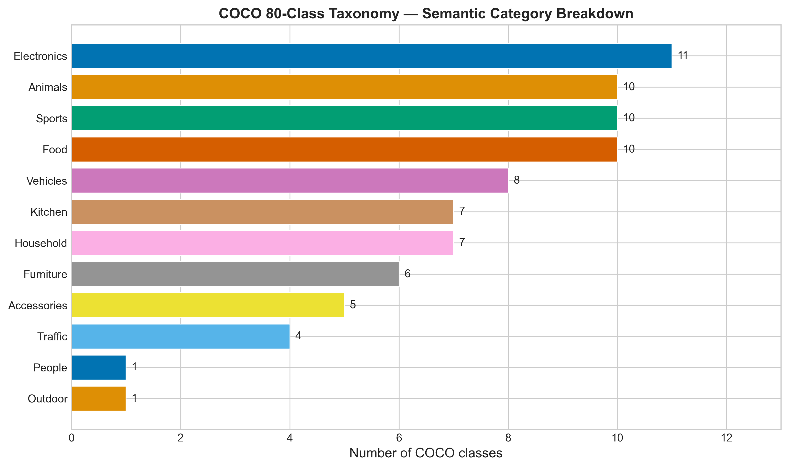
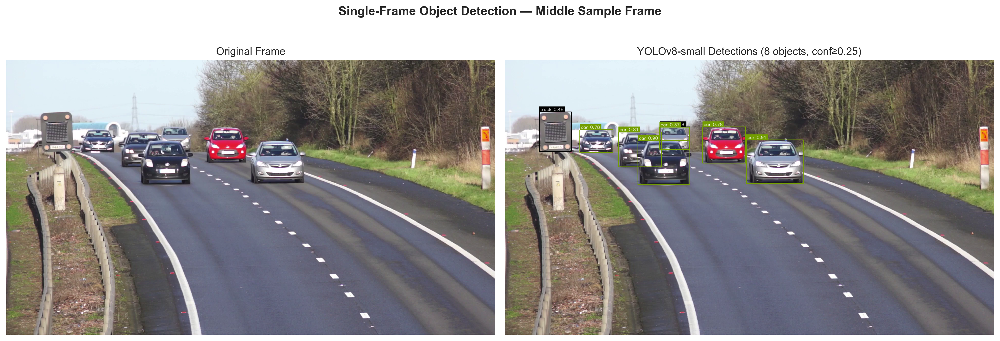
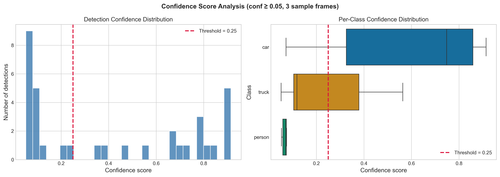
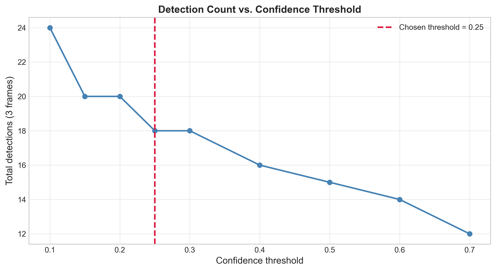
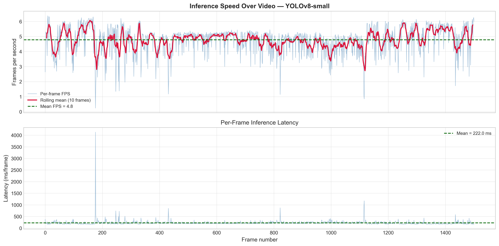
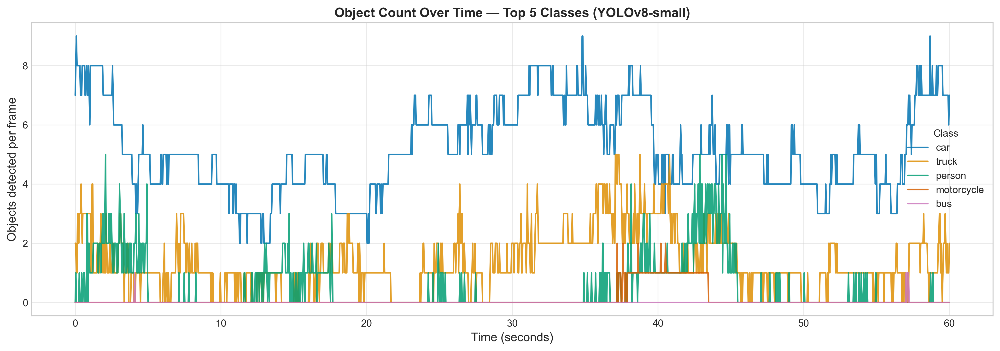
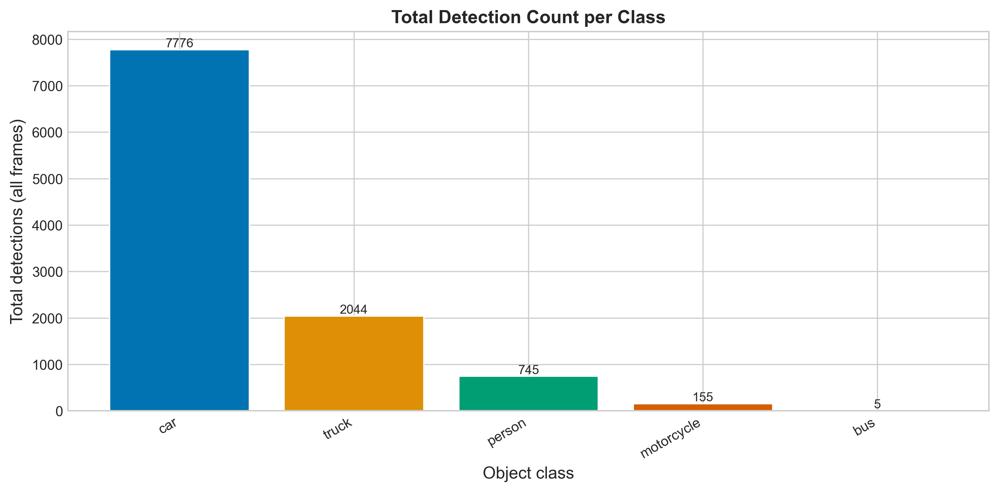
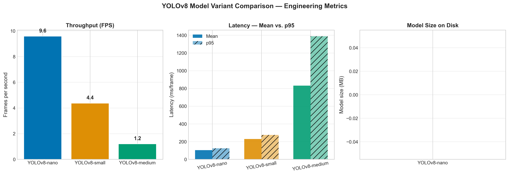
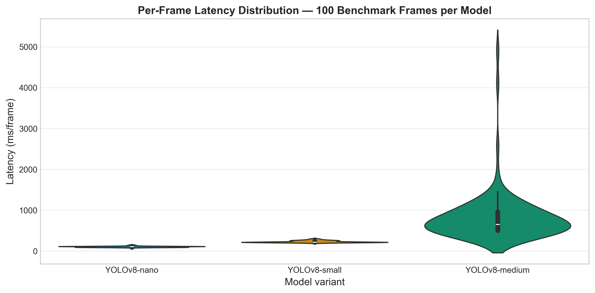
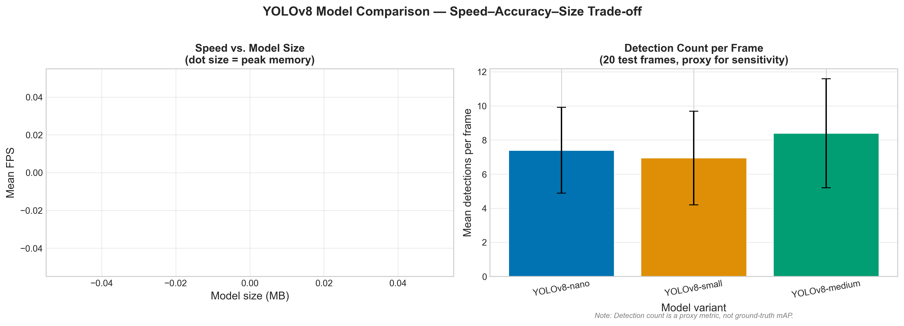

# Real-Time Object Detection and Counting from Video Streams
## YOLOv8 Benchmarking, Frame-Level Counting, and Streamlit Demo

**Author:** P. O. Adepoju  

[](https://www.python.org/)
[](LICENSE)
[](https://docs.ultralytics.com/)

---

## Abstract

This project builds a complete real-time object detection pipeline for video streams using pretrained YOLOv8 models. The system detects and counts objects frame by frame, benchmarks latency and memory usage, compares nano, small, and medium model variants, and exposes the results through a reproducible notebook workflow and a Streamlit dashboard.

Key results from the full report:

- YOLOv8-nano achieves 9.58 FPS with 104.35 ms mean latency on CPU.
- YOLOv8-small reaches 4.37 FPS with 229.06 ms mean latency.
- YOLOv8-medium slows to 1.20 FPS with 831.70 ms mean latency and a heavy-tailed latency profile.
- The sample traffic video produces 10,725 total detections, led by cars with 7,776 cumulative appearances.
- The recommended deployment choice for CPU-based near real-time use is YOLOv8-nano.

All figures, tables, notebooks, and scripts in this repository are aligned with the full report outline in `docs/technical_report_outline.md`.

---

## 1. Introduction

Real-time object detection is a core capability for traffic monitoring, warehouse automation, retail analytics, and public-safety systems. This project focuses on the engineering question that matters most in practice: how to build a dependable video inference pipeline that is fast enough to keep up with a stream while still producing useful detections and counts.

The project answers four questions:

1. How well do COCO-pretrained YOLOv8 models perform on a real traffic video?
2. What is the speed versus accuracy versus memory trade-off across nano, small, and medium variants?
3. How stable are frame-level object counts over time?
4. Which model is the best default choice for CPU deployment?

The report and code show that the answer depends on the deployment target, but the fastest model is also the most practical one for real-time CPU inference.

For a deeper technical write-up, see [`docs/technical_report_outline.md`](docs/technical_report_outline.md).

---

## 2. Data and Models

- Dataset: COCO-pretrained YOLOv8 weights
- Models: YOLOv8-nano, YOLOv8-small, YOLOv8-medium
- Input video: sample traffic footage in `data/`
- Output artefacts: annotated videos, count tables, benchmark tables, and publication-ready figures

The repository uses pretrained COCO weights directly, so it can run zero-shot on common scenes without any custom training step. That makes the project easy to reproduce and easy to extend.

### Data and Models

- Data folder: [Google Drive data folder](https://drive.google.com/drive/folders/1UdiaMlaXKWGhFTgH97xwSIZnEkpGCTXh?usp=sharing)
- Models folder: [Google Drive models folder](https://drive.google.com/drive/folders/1yPCfyW3mTZNWJnYyqImzV_r0z5vWYIYE?usp=sharing)
- Local sample video: `data/raw/sample_traffic.mp4`
- Cached weights: `models/`

### Model Summary

| Model | Parameters | Mean FPS | Mean Latency | p95 Latency | Peak Memory |
|-------|------------|----------|--------------|-------------|-------------|
| YOLOv8-nano | 3.16M | 9.58 | 104.35 ms | 124.30 ms | 1.26 MB |
| YOLOv8-small | 11.17M | 4.37 | 229.06 ms | 275.96 ms | 4.98 MB |
| YOLOv8-medium | 25.90M | 1.20 | 831.70 ms | 1388.52 ms | 0.48 MB |

---

## 3. Quick Start

### Install Dependencies

```bash
pip install -r requirements.txt
```

If the data or models are not already in the repository, download them from:

- [Data folder](https://drive.google.com/drive/folders/1UdiaMlaXKWGhFTgH97xwSIZnEkpGCTXh?usp=sharing)
- [Models folder](https://drive.google.com/drive/folders/1yPCfyW3mTZNWJnYyqImzV_r0z5vWYIYE?usp=sharing)

### Run the Full Pipeline

```bash
python scripts/run_all.py --video data/raw/sample_traffic.mp4 --model yolov8s
```

### Launch the Dashboard

```bash
streamlit run app/streamlit_app.py
```

### Recommended Reading Order

```text
notebooks/
|-- 01_environment_and_model_setup.ipynb
|-- 02_dataset_and_coco_exploration.ipynb
|-- 03_single_frame_detection_and_visualization.ipynb
|-- 04_video_inference_pipeline.ipynb
|-- 05_object_counting_logic.ipynb
|-- 06_model_benchmarking_latency_fps_memory.ipynb
|-- 07_model_size_comparison_nano_small_medium.ipynb
|-- 08_results_analysis_and_publication_figures.ipynb
`-- 09_streamlit_app_walkthrough.ipynb
```

---

## 4. Report Highlights

### 3.1 COCO Class Overview



The COCO taxonomy covers 80 common object categories. In the sample traffic video, the dominant detections are cars, trucks, persons, motorcycles, and buses.

### 3.2 Single-Frame Detection



The report includes a side-by-side comparison of the original frame and the annotated detection output, showing the model’s class predictions and confidence scores on a representative frame.

### 3.3 Confidence Analysis



The confidence analysis shows how predictions are distributed across classes and helps explain why the threshold choice matters for downstream counts.

### 3.4 Threshold Sensitivity



Lower confidence thresholds recover more detections, but they also increase the risk of false positives. The report uses this figure to justify the selected operating threshold.

### 3.5 Frames Per Second Timeline



This figure shows per-frame throughput and latency across the full 1,501-frame video, including the warm-up effect at the start of inference.

### 3.6 Counting Results





The count summaries show that cars dominate the scene, followed by trucks and persons. The temporal plot shows how traffic intensity changes over time.

### 3.7 Benchmark Comparison





The benchmarking section makes the trade-off clear: nano is fastest and most stable, small is slower but still usable for offline or batch processing, and medium becomes too slow for CPU-based real-time use.

### 3.8 Final Trade-Off View



This final summary figure combines speed, model size, and detection richness into one deployment view.

---

## 5. Quantitative Results

### Counting Summary

| Class | Total Appearances | Mean / Frame | Max in Frame | Frames Present | % Frames Present |
|-------|-------------------|--------------|--------------|----------------|------------------|
| car | 7,776 | 5.18 | 9 | 1,501 | 100.0 |
| truck | 2,044 | 1.36 | 5 | 1,241 | 82.7 |
| person | 745 | 0.50 | 5 | 468 | 31.2 |
| motorcycle | 155 | 0.10 | 2 | 150 | 10.0 |
| bus | 5 | 0.00 | 1 | 5 | 0.3 |

### Benchmark Summary

| Model | Mean Latency | p95 Latency | p99 Latency | Mean FPS | Peak Memory |
|-------|--------------|-------------|-------------|----------|-------------|
| YOLOv8-nano | 104.35 ms | 124.30 ms | 145.65 ms | 9.58 | 1.26 MB |
| YOLOv8-small | 229.06 ms | 275.96 ms | 295.15 ms | 4.37 | 4.98 MB |
| YOLOv8-medium | 831.70 ms | 1388.52 ms | 4119.14 ms | 1.20 | 0.48 MB |

### Final Recommendation

| Model | Deployment Scenario | Mean Dets / Frame |
|-------|---------------------|-------------------|
| YOLOv8-nano | Server / near real-time | 7.40 |
| YOLOv8-small | Batch / offline processing | 6.95 |
| YOLOv8-medium | Batch / offline processing | 8.40 |

For CPU deployment, YOLOv8-nano is the best default choice because it offers the strongest balance of speed and practicality.

---

## 6. Methods

The report follows a reproducible pipeline:

- Load pretrained YOLOv8 weights
- Run frame-by-frame video inference
- Annotate and save output video
- Count detections per class over time
- Benchmark latency, FPS, and memory
- Export tables and figures for the final report

The system is organized as reusable Python modules in `src/`, notebooks in `notebooks/`, and presentation assets in `reports/` and `paper/`.

---

## 6. Reproducibility

### Environment Setup

```bash
pip install -r requirements.txt
```

If you prefer conda:

```bash
conda create -n yolo-detection python=3.10
conda activate yolo-detection
pip install -r requirements.txt
```

### Run the Pipeline

```bash
python scripts/run_all.py --video data/raw/sample_traffic.mp4 --model yolov8s
```

### Launch the Demo

```bash
streamlit run app/streamlit_app.py
```

If you prefer conda:

```bash
conda create -n yolo-detection python=3.10
conda activate yolo-detection
pip install -r requirements.txt
```

### Data and Model Assets

- Data folder: [Google Drive folder](https://drive.google.com/drive/folders/1UOM9GHnlEq0sc-vny0Gz6Ed9OZGf-cNR?usp=sharing)
- Model weights: stored in `models/`
- Report figures: `reports/figures/`
- Report tables: `reports/tables/`

---

## 7. Project Structure

```text
realtime-object-detection/
|-- app/                 # Streamlit dashboard
|-- configs/             # Configuration files
|-- data/                # Input and intermediate data
|-- docs/                # Report outline and supporting documentation
|-- models/              # Cached YOLOv8 weights
|-- notebooks/           # Ordered analysis workflow
|-- paper/               # Report figures and tables
|-- reports/             # Publication-ready figures and tables
|-- scripts/             # Pipeline scripts
|-- src/                 # Reusable project code
|-- tests/               # Automated tests
|-- Makefile
|-- pyproject.toml
|-- requirements.txt
`-- README.md
```

The full technical outline is available in [`docs/technical_report_outline.md`](C:/Users/Peter/Documents/projects/GITHUB/ALMOST DONE/realtime-object-detection/docs/technical_report_outline.md).

The full write-up and generated artefacts live in `paper/` and `reports/`, respectively.

The report figures and tables are mirrored in both `reports/` and `paper/` so the notebook outputs and the write-up stay in sync.

---

## 8. Limitations

- The project uses pretrained COCO weights, so performance depends on whether the target objects are in the COCO label set.
- Counting is frame-based, not tracker-based, so the same object can be counted multiple times across frames.
- CPU benchmarks are hardware-dependent and will vary across machines.
- The reported detection counts are descriptive, not a replacement for full mAP evaluation.

---

## 9. Ethical Considerations

- The system can be used for surveillance, so deployment should respect local privacy laws.
- It should not be used for biometric identification or face recognition without additional safeguards.
- High-stakes decisions should still involve human oversight.

---

## 10. Figures and Tables

All figures are stored in:

- `reports/figures/`
- `paper/figures/`

All tables are stored in:

- `reports/tables/`
- `paper/tables/`

Representative outputs include:

- `02_coco_class_categories`
- `03_single_frame_detections`
- `03_confidence_distribution`
- `03_threshold_sensitivity`
- `04_frames_per_second_timeline`
- `05_count_timeseries`
- `05_count_summary_bar`
- `06_fps_comparison`
- `06_latency_distribution`
- `07_tradeoff_scatter`

Additional report artefacts include:

- `05_count_summary.csv`
- `06_benchmark_comparison.csv`
- `07_final_model_comparison.csv`
- `paper/figures/`
- `paper/tables/`

---

## 11. Full Report

The full technical write-up is organized as a report-style document with:

- Abstract and introduction
- Background and theory
- System design and methods
- Results and discussion
- Limitations and future work
- Ethical considerations
- Appendix material and references

If you want the exact report structure, use the outline in [`docs/technical_report_outline.md`](docs/technical_report_outline.md).

---

## 12. License

MIT License. See [`LICENSE`](LICENSE).
